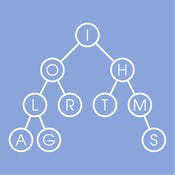

<!-- [Trees](#trees), [Tries](#tries), & [Graphs](#graphs) -->
# Data Structures, Algorithms, and Other CS Concepts

## Table of Contents
* [About the Project](#about-the-project)
* [Built With](#built-with)

| Data Structures | Algorithms | Concepts |
| :---: | :---: | :---: |
| [Linked Lists](#linked-lists) | Breadth-First Search | Bit Manipulation |
| [Trees](#trees), Tries, & Graphs | Depth-First Search | Memory (Stack vs. Heap) |
| Stacks & Queues | Binary Search | Recursion |
| Heaps | Merge Sort | Dynamic Programming |
| Vectors / ArrayLists | Quick Sort | [Big O Time & Space](#big-O-time-and-space) |
| Hash Tables | | |

* [Contact](#contact)
* [Acknowledgements](#acknowledgements)

## About the Project
In order to enhance my coding skills and perform well in technical interviews, as per recommendation by *Cracking the Coding Interview* Author Gayle McDowell (pgs. 60-61), I am coding all listed concepts in the table below from scratch.

## Built With
* [JavaScript (Wiki)](https://en.wikipedia.org/wiki/JavaScript)
# Data Structures
## Linked Lists

File: *dataStructures/linkedLists.js* 

| Pros | Cons |
| :---: | :---: |
| 1. Can add or remove nodes easily without reorganizing the whole data structure. | 1. Search operation is slow since you have to sequentially go over the list. | 
| |2. Uses more storage space due to storing pointers
### Big O

 

 
## Trees

File: *dataStructures/binarySearchTree.js*

### Big O

 

### Traversals
* In-Order
    - In-order traversal means to "visit" (often, print) the left branch, then the current node, and finally, the right branch. 
* Pre-Order
    - Pre-order traversal visits the current node before its child nodes (hence the name "pre-order"). 
* Post-Order
    - Post-order traversal visits the current node after its child nodes (hence the name "post order"). In a post-order traversal, the root is always the last node visited.  

<!--
## Tries 

## Graphs

## Stacks 

## Queues

## Heaps

## Vectors / ArrayLists

## Hash Tables

-->
<!--  
# Algorithms
## Breadth-First Search

## Depth-First Search

## Binary Search

## Merge Sort

## Quick Sort

 
-->
# Concepts
<!--  
## Bit Manipulation

## Memory (Stack vs. Heap)

## Recursion

## Dynamic Programming

-->
### Big O Time and Space

File: *concepts/bigO.apkg* (Anki Deck)

### Time Complexity
* Big O is the language and metric that describes the efficiency of an algorithm
* If you don’t know it well, then:
    - You will be judged harshly by other programmers and colleagues
    - Struggle to judge whether your algorithm is getting faster or slower
* *Master Big O!*
* Some of most common runtimes are:
    - O(log N)
    - O(N log N)
    - O(N)
    - O(N^2)
    - O(2^N)
* You can have multiple variables in your runtime
    - To paint a fence that’s w meters wide and h meters high could be described as O(wh).
    - If you need p layers of paint, then the time is O(whp)
### Space Complexity
* The amount of memory required by an algorithm is also important.
* Parallel to time complexity
* An array of size n, requires O(n) space.
    - If 2D array of size n x n, requires O(n^2) space

 

# Contact
Tom Lancaster - thomas.m.lancaster@gmail.com
- [Portfolio](https://tlan2.github.io/portfolio/) 
- [LinkedIn](https://www.linkedin.com/in/thomasmorelancaster/) 
- [GitHub](https://github.com/tlan2)

 

# Acknowledgements
## General
- [Cracking the Coding Interview](https://www.crackingthecodinginterview.com)

## Data Structures
* Linked Lists
    - [How to Implement a Linked List in Java - freecodecamp.com](https://www.freecodecamp.org/news/implementing-a-linked-list-in-javascript/)
    - [Linked Lists in JavaScript (ES6 code) - codeburst.io](https://codeburst.io/linked-lists-in-javascript-es6-code-part-1-6dd349c3dcc3)
    - [Data Structures - Linked Lists  \[by Cracking the Coding Interiew author Gayle McDowell\] (YouTube)](https://www.youtube.com/watch?v=njTh_OwMljA)
* Trees, Tries, & Graphs
    - [Data Structures - Trees \[by Cracking the Coding Interiew author Gayle McDowell\] (YouTube)](https://www.youtube.com/watch?v=oSWTXtMglKE)
* Stacks & Queues
* Heaps
* Vectors / ArrayLists
* Hash Tables
## Algorithms
* Breadth-First Search
* Depth-First Search
* Binary Search
* Merge Sort
* Quick Sort
## Concepts
* Bit Manipulation
* Memory (Stack vs. Heap)
* Recursion
* Dynamic Programming
* Big O Time & Space
    - [Cracking the Coding Interview](https://www.crackingthecodinginterview.com) - Ch VI - "Big O"
    - [bigOcheatsheet.com](https://www.bigocheatsheet.com)

