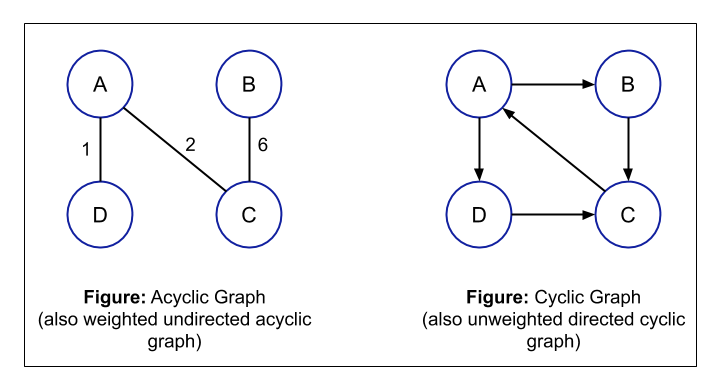

# Data Structures, Algorithms, and Other CS Concepts

## Table of Contents
* [About the Project](#about-the-project)
* [Built With](#built-with)

| [Data Structures](#data-structures) | [Algorithms](#algorithms) | [Concepts](#concepts) |
| :---: | :---: | :---: |
| [Linked Lists](#linked-lists) | [Breadth-First Search](#breadth-first-search) | [Bit Manipulation](#bit-manipulation) |
| [Trees](#trees), [Tries](#tries), & [Graphs](#graphs) | [Depth-First Search](#depth-first-search) | [Memory](#memory)  |
| [Stacks](#stacks) & [Queues](#queues) | [Binary Search](#binary-search) | [Recursion](#recursion) |
| [Heaps](#heaps) | [Merge Sort](#merge-sort) | [Dynamic Programming](#dynamic-programming) |
| [Vectors / ArrayLists](#vectors-/-arraylists) | [Quick Sort](#quick-sort) | [Big O Time & Space](#big-O-time-and-space) |
| [Hash Tables](#hash-tables) | [Union Find](#union-find) | |
* [Contact](#contact)
* [Acknowledgements](#acknowledgements)

## About the Project
In order to enhance my coding skills and perform well in technical interviews, as per recommendation by *Cracking the Coding Interview* Author Gayle McDowell (pgs. 60-61), I am reviewing and coding all listed concepts in the table above from scratch.

## Built With
* [JavaScript (Wikipedia)](https://en.wikipedia.org/wiki/JavaScript)
# Data Structures
## Linked Lists
Singly Linked List

Doubly Linked List

Circular Linked List

File: *dataStructures/linkedLists.js* 

A linked list is a data structure that represents a sequence of nodes. In a singly linked list, each node points to the next node in the linked list. A doubly linked list gives each node pointers to both the next node and the previous node.
 
 
It is conceptually the same as an array with the only difference bing the efficiency of various operations. Most importantly:
- Insertion in middle: O(1) for linked list, O(n) for array
- Direct access to middle element: O(n) for linked list, O(1) for array

| Pros | Cons |
| :---: | :---: |
| 1. Insertion/Deletion - Can add or remove nodes easily without reorganizing the whole data structure. | 1. Search/Access - Search operation is slow since you have to sequentially go over the list. | 
| |2. Space - Uses more storage space due to storing pointers

### Real-Life Examples
1. Conga Line (Metaphorical)
 
2. Network Message Delivery (Singly Linked List)
Message is broken down into packets and each packet has a key to the next one.
 
3. Browser cache w/ Back Button (Doubly Linked List)
4. DNA Molecules (Doubly Linked List)
5. List of website users that need to be emailed an notification

### Linked Lists - Big O

### Linked Lists - Resources 
1. "How to Implement a Linked List in Java" Article [(freecodecamp.com)](https://www.freecodecamp.org/news/implementing-a-linked-list-in-javascript/) 
2. "Linked Lists in JavaScript" Article [(codeburst.io)](https://codeburst.io/linked-lists-in-javascript-es6-code-part-1-6dd349c3dcc3)
3. Data Structures - Linked Lists Video (by Cracking the Coding Interview author Gayle McDowell) [(YouTube)](https://www.youtube.com/watch?v=njTh_OwMljA)
4. "What is a practical, real world example of the Linked List?" Article [(stackoverflow)](https://stackoverflow.com/questions/644167/what-is-a-practical-real-world-example-of-the-linked-list)
 

[Back to Table of Contents](#table-of-contents)

## Trees

File: *dataStructures/binarySearchTree.js*

Report: *[Final Project Report](https://drive.google.com/file/d/15tfnANoty4ZpfQTqUiNw9XIQhUfkCtN-/view)* on B-trees, Red-Black trees, and Binary Search trees for Graduate Algorithms Course

A tree is a data structure composed of nodes that:
* Has a root node
* The root node has zero or more child nodes
* Each child node has zero or more child nodes
* Does not contain cycles
* May or may not be in a particular order
* Can have any data type as values
* May or may not have links back to their parent nodes
### Key Terms
* **Root**: top node of tree where all operations start
* **Node**: each item in the tree, usually key-value
* **Parent**: a node which is a *predecessor* of any node
* **Child**: a node which is a *descendant* of any ndoe
* **Siblings**: a group of nodes that have the same parent
* **Leaf**: a node without children
* **Level**: 1 + the number of edges between the node and the root
* **Height**: the number of edges from the root to its furthest leaf
* **Depth**: the number of edges from the node to the tree's root
* **Sub-tree**: a portion of the tree that can be viewed as a complete tree in itself
### Types of Trees
* **Binary / *n*-ary Tree**: 
    
    

    A binary tree is a tree in which each node has up to two children while an *n*-ary tree can have *n* possible children such ternary tree which has 3 children.
    
* **Binary *Search* Tree**: 
     
     

    A binary search tree is a binary tree in which every node fits a specific ordering property: *all left descendents <= n < all right descendents*. This must be true for each node n. Duplicate values are sometimes permitted depending on the interviewer.
   
* **Balanced / Unbalanced Tree**:
     
     

    Balanced tree means something more like “not terribly imbalance.” It is balanced enough to ensure *O(log n)* insert and find times.
    *Note: In interviews, assume you have a balanced tree.*
    - 2 common types of balanced trees:
        - Red-black trees
        - AVL trees

* **Complete Binary Tree**:
    
    

    A complete binary tree is a binary tree in which every level of the tree is fully filled, except for perhaps the last level. To the extent that the last level is filled, it is filled left to right.

* **Full Binary Tree**:
    
    

    A full binary tree is a binary tree in which every node has either zero or two children. That is, no nodes have only one child.

* **Perfect Binary Tree**:

    
    
    A perfect binary tree is one that is both full and complete. All leaf nodes will be at the same level, and this level has the maximum number of nodes. 
### Traversals
* In-Order
    - In-order traversal means to "visit" (often, print) the left branch, then the current node, and finally, the right branch. 
* Pre-Order
    - Pre-order traversal visits the current node before its child nodes (hence the name "pre-order"). 
* Post-Order
    - Post-order traversal visits the current node after its child nodes (hence the name "post order"). In a post-order traversal, the root is always the last node visited.     

### Real-Life Examples

### Trees - Big O

 

### Trees - Resources 
1. Data Structures - Trees (by Cracking the Coding Interiew author Gayle McDowell) Video[ (YouTube)](https://www.youtube.com/watch?v=oSWTXtMglKE)
2. "Trees vs. Graphs" Article [(Open4Tech.com)](https://open4tech.com/trees-vs-graphs/)

[Back to Table of Contents](#table-of-contents)
## Tries 

- A trie (sometimes called a prefix tree) is a variant of an n-ary tree in which characters are stored at each node. Each path down the tree may
represent a word.
- The * nodes (sometimes called "null nodes") are often used to indicate complete words. For example, the fact that there is a * node under MANY indicates that MANY is a complete word. The existence of the MA path indicates there are words that start with MA. 
- In situations when we search
through the tree on related prefixes repeatedly (e.g., looking up M, then MA, then MAN, then MANY), we might pass around a reference to the current node in the tree. This will allow us to just check if Y is a child of MAN, rather than starting from the root each time. 

Real-Life Example(s)

1. Quick prefix lookups - While a hash
table can quickly look up whether a string is a valid word, it cannot tell us if a string is a prefix of any valid words. A trie can do this very quickly.
### Tries - Resources 
1. Data Structures: Tries (by Cracking the Coding Interview author Gayle McDowell) Video [(YouTube)](https://www.youtube.com/watch?v=zIjfhVPRZCg&list=PLX6IKgS15Ue02WDPRCmYKuZicQHit9kFt&index=16)
 

[Back to Table of Contents](#table-of-contents)
## Graphs

A graph is a collection of nodes with edges between (some of) them.
 

- Graphs can be directed or undirected. Directed are like 1-way streets and undirected are like 2 way streets.
 

- A graph might consist of multiple isolated subgraphs. If there is a path between every pair of vertices, it is called a "connected graph."
 

- A graph can have cycles. An "acyclic graph" is one without cycles.
 

- Programmatically, there are two common ways to represent a graph:
    1. Adjacency List
        - Most common way to represent a graph. Node classes are usually used.
        - Every vertex/node stores a list of adjacent vertices.
        - Simple Class Definition
         
        
        
    2. Adjacency Matrixes
        - NxN bolean matrix where N is the number of nodes. A true value at matrix[i][j] indicates an edge from node i to node j.
        - In an undirected grpah, an adjacency matrix will be symmetric. In a directed graph, it will not be.
- Graphs with adjacency may be somewhat less efficient. In the adjacency list representation, you can easily iterate through the neighbors of the node. In the adjacency matrix, you will need to iterate through all the nodes to identify a node's neighbors.
 

### Graphs - Resources 
1.

 

[Back to Table of Contents](#table-of-contents)
## Stacks 

- A stack is a stack of data.
- Uses last-in first-out (LIFO) ordering. For example, the most recent dinner plate put on the stack is the first item to be removed.
- Operations:
    - pop(): Remove the top item from the stack.
    - push(item): Add an item to the top of the stack
    - peek(): Return the top of the stack.
    - isEmpty(): Return true if and only if the stack is empty.
- Has constant-time adds and removes.
- No constant-time access.
- Can be implemented as a linked list *as long as* the items are added and removed from *the same side*.
- Use Case: Certain recursive algorithms.
### Stacks - Big O

### Stacks - Resources 
1. Data Structures: Stacks & Queues (by Cracking the Coding Interview author Gayle McDowell)  Video [(YouTube)](https://www.youtube.com/watch?v=wjI1WNcIntg&list=PLOuZYwbmgZWXvkghUyMLdI90IwxbNCiWK&index=31)
 

[Back to Table of Contents](#table-of-contents)
## Queues

- With a queue, items are removed from the data structure in the same order that they are added which is FIFO (first-in first-out) ordering.
- Operations:
    - add(item): Add an item to the end of the list.
    - remove(): Remove the first item in the list.
    - peek(): Return the top of the queue.
    - isEmpty(): Return true if and only if the queue is empty.
- Can be implemented as linked list *as long as* items are added and removed from *opposite sides*.
- Use Case: Implementing a cache
### Queues - Big O

### Queues - Resources 
1. Data Structures: Stacks & Queues (by Cracking the Coding Interview author Gayle McDowell)  Video [(YouTube)](https://www.youtube.com/watch?v=wjI1WNcIntg&list=PLOuZYwbmgZWXvkghUyMLdI90IwxbNCiWK&index=31)
 

[Back to Table of Contents](#table-of-contents)

## Heaps

- Heaps, or binary heaps, can come in either a max-heap or min-heap.
- It is a complete tree (that is, totally filled other than the rightmost elements on the last
level) where each node is smaller than the children.
- The root is either the min or max element in the tree.
- 2 main operations
    - Insert
    
        - When inserting an element, you always start at the bottom and right-most spot.
        - The new element is then swapped with the parent until it is in the appropriate location.
        - Takes O(N) time
    - extract_min / extract_max
    
        - Finding the minimum or maximum value is but removing it is tricky.
        - First, swap the min element with bottommost right element
        - Resort the list through swaps or "bubble sort" until the element arrives in its correct location
        - Takes O(log N) time
### Heaps -  Resources 
1. Data Structures: Heaps (by Cracking the Coding Interview author Gayle McDowell) Video [(YouTube)](https://www.youtube.com/watch?v=t0Cq6tVNRBA&list=PLOuZYwbmgZWXvkghUyMLdI90IwxbNCiWK&index=11) 

 

[Back to Table of Contents](#table-of-contents)
## Vectors / ArrayLists

- Use ArrayLists when you need an array-like structure that dynamically resizes itself with O(1) access.
- When the array is full, it doubles in size which takes O(N) time.
- Amortized insertion time is O(1) on average but is O(N) in worst case.
- Know the name of the ArrayList structure in whatever langauge you are working in. For example, it is called ArrayList in Java. (Arrays are a fixed size in Java.)
### ArrayLists - Resources 
1. 
 

[Back to Table of Contents](#table-of-contents)

## Hash Tables

 

- A data structure that mapes keys to values for highly efficient lookups
- Example Simple Yet Common Implementation:
    1. Computer the hash code which is usually an *int* or *long*.
    2. Map hash code to index in array using something like *hash(key) % array_length*.
    3. Store value in linked list in array.
- If the number of collisions is very high, then worst case runtime is O(N) where N is the number of keys. Otherwise, lookup time is O(1)

- Can also implement hash table with a balanced binary search tree which gives us O(log N) lookup time and potentially uses less space since we are not allocating space for a large array. Can also iterate through keys in order.
### Hash Table - Big O

### Hash Table - Resources 
1. Data Structures: Hash Tables (by Cracking the Coding Interview author Gayle McDowell) [(YouTube)](https://www.youtube.com/watch?v=shs0KM3wKv8&list=PLOuZYwbmgZWXvkghUyMLdI90IwxbNCiWK&index=5)
 

[Back to Table of Contents](#table-of-contents) 
# Algorithms
## Breadth-First Search

 
- BFS starts at the root and explores each neighbor before going o nto any of their children. We go wide (hence *breadth*-first search) before we go deep.
- BFS is *not* recursive and uses a queue to visit all the neighbors.
- If you want to find the shortes path between 2 nodes, BFS is generally better.
- Use Case: Find degrees of separation between two friends or exploring a network of friendships.
### BFS - Resources 
1. Algorithms: Graph Search, DFS, and BFS by Cracking the Coding Interview author Gayle McDowell [(YouTube)](https://www.youtube.com/watch?v=zaBhtODEL0w)
 

[Back to Table of Contents](#table-of-contents)

## Depth-First Search

- DFS preferred if you want to visit every node in the graph.
- Exhaustively explore each branch before moving onto the next one.
- Is typically recursive and requires a *visited* flag.
- Simpler to implement than BFS.
### DFS - Resources 
1. Algorithms: Graph Search, DFS, and BFS by Cracking the Coding Interview author Gayle McDowell [(YouTube)](https://www.youtube.com/watch?v=zaBhtODEL0w)

 

[Back to Table of Contents](#table-of-contents)

## Binary Search

- Must always operate on something that is sorted such as a sorted array. 
- In a sorted array, binary search compares an element *x* at the midpoint of the array. If *x* is greater than the midpoint value, then find the midpoint of the right side and compare again. If *x* is less than the midpoint, find the midpoint of the left side and compare again. Do this repeatedly until you find your targeted value.
- Is O(log N).
- 

### Binary Search Tree - Big O

 

### Binary Search Resources 
1. Algorithms: Binary Search by Cracking the Coding Interview author Gayle McDowell [(YouTube)](https://www.youtube.com/watch?v=P3YID7liBug&list=PLOuZYwbmgZWXvkghUyMLdI90IwxbNCiWK&index=27)

[Back to Table of Contents](#table-of-contents)
## Merge Sort

- "Merge sort divides the array in half, sorts each of those halves, and then merges them back together. Each
of those halves has the same sorting algorithm applied to it." - pg. 146, Cracking the Coding Interview
- Copies all elements from the target array into a helper array with trackers of the left and right starting point (called helperLeft and helperRight for example.)
- Time Complexity: O(n log(n)) for average and worst case. Space Complexity: O(n) 

### Merge Sort - Big O

### Merge Sort - Resources 
1. Algorithms: Merge Sort (by Cracking the Coding Interview author Gayle McDowell) [(YouTube)](https://www.youtube.com/watch?v=KF2j-9iSf4Q&list=PLOuZYwbmgZWXvkghUyMLdI90IwxbNCiWK&index=20)
 

[Back to Table of Contents](#table-of-contents)
## Quick Sort

- Quick sort operates by picking a random element *x* and partitioning the array so all the numbers are greater or less than *x*. Partitioning can be performed efficiently through a series of swaps. Repeatedly partitioning the array around an element eventually sorts the array.
- Since our partitioned element isn't guaranteed to be the median, the worst case runtime is O(n2)

### Quick Sort - Big O

### Resources 
1. Algorithms: Quicksort (by Cracking the Coding Interview author Gayle McDowell) Video [(YouTube)](https://www.youtube.com/watch?v=SLauY6PpjW4&list=PLOuZYwbmgZWXvkghUyMLdI90IwxbNCiWK&index=21)
 

 

[Back to Table of Contents](#table-of-contents)
# Concepts  
## Bit Manipulation

- Bit Facts and Tricks

- Two's Complement
    - The first bit decides whether a number is positive or negative. If the first number is 1 then it is positive and if it is 0 then it is negative.
    - Computers typically store integers in two's complement representation.
    - There are two ways to find a negative number:
        1. The two's complement of an N-bit number (where N is the number of bits used for the number, excluding the sign bit) is the complement of the number with respect to 2N.
            - Example: Let's look at the 4-bit integer -3. If it's a 4-bit number, we have one bit for the sign and three bits for the value. We want the complement with respect to 23 which is 8. The complement of 3 (the absolute value of -3) with respect to 8 is 5. 5 in binary is 101. Therefore, -3 in binary as a 4-bit number is 1101, with the first bit being the sign bit
        2. Invert the bits in the positive representation, and then add 1. 
            - Example: 3 is 011 in binary. Flip the bits to get 100, add 1 to get 101, then prepend the sign bit (1) to get 1101.

- Shifts
    - Left shift (<<<) generally multiplies a number by 2 and an arithmetic right shift generally divides a number by 2.
    - Arithmetic vs. Logical Right Shift 
        - Logical right shift adds a 0 to the front of the binary number.  It is represented as >>>.
        
        - Arithmetic right shift adds a 1 to the front the binary number. It is represented as >>.
        
### Resources 
1. Algorithms: Bit Manipulatoin (by Cracking the Coding Interview author Gayle McDowell) Video [(YouTube)](https://www.youtube.com/watch?v=NLKQEOgBAnw&t=64s)
 

[Back to Table of Contents](#table-of-contents)
## Memory 

- Stack Allocation
    - Contiguous blocks of memory
    - Size to be allocated is known to compiler and whenever the method is called, its variables get memory allocated on the stack.
    - Whenever the method is finished, the memory is automatically flushed or deallocated.
    - Is safer because it can only be accessed by owner thread.
    - Faster than Heap-memory allocation
    - Has less storage space than Heap-memory
- Heap Allocation
    - Called heap because it is a pile of memory space available to programmers to allocate and de-allocate.
    - Not thread-safe. Data is visible/accessible by all threads
    - If not handled well by the programmer, then a memory leak can happen to the program. 
    - Divided into 3 categories:
        1. Younger Generation - portion of memory for all new data (objects). When filled, the rest of the data is stored in Garbage collection.
        2. Old/Tenured Generation - Contains older data objects that aren't in frequent use or not in use at all.
        3. Permanent Generation - Contains JVM's metadata for the runtime classes and application methods
    - Garbage collector needed to remove old unused objects since it isn't automatically removed and to use the space more efficiently.
    - Space is quite larger than the stack
    - Exists as long the whole application runs
- Key Differences
    - Automatic allocation & deallocation 
        - Stack - Done by compiler.
        - Heap - Manually handled by programmer
    - Cost
        - Stack - Less
        - Heap - More
    - Problems
        - Stack - Memory Shortage
        - Heap - Fragmentation
    - Cache
        - Stack - Cache-friendly since it has small region of memory
        - Heap - Not cache-friendly since memory is dispersed throughout the memory and is therefore more likely to cause cache misses.
    - Flexibility
        - Stack - Not flexible since memory size cannot be changed.
        - Heap - Flexible and alloted memory can be altered
    - Access Time
        - Stack - Quicker since contiguous
        - Heap - Slower since more spread out
- Summary Comparison Chart from GeeksforGeeks

### Resources 
1. "Stack vs Heap Memory Allocation" Article [(geeksforgeeks.org}](https://www.geeksforgeeks.org/stack-vs-heap-memory-allocation/)
 

[Back to Table of Contents](#table-of-contents)
## Recursion

### Resources 
1. Algorithms: Recursion (by Cracking the Coding Interview author Gayle McDowell) Video [(YouTube)](https://www.youtube.com/watch?v=KEEKn7Me-ms&list=PLOuZYwbmgZWXvkghUyMLdI90IwxbNCiWK&index=33)
 

[Back to Table of Contents](#table-of-contents)
## Dynamic Programming

### Resources 
1. Algorithms: Memoization and Dynamic Programming by Cracking the Coding Interview author Gayle McDowell Video [(YouTube)](https://www.youtube.com/watch?v=P8Xa2BitN3I&list=PLOuZYwbmgZWXvkghUyMLdI90IwxbNCiWK&index=14)
 

[Back to Table of Contents](#table-of-contents)
### Big O Time and Space

File: *concepts/bigO.apkg* (Anki Deck)

### Time Complexity
* Big O is the language and metric that describes the efficiency of an algorithm
* If you don’t know it well, then:
    - You will be judged harshly by other programmers and colleagues
    - Struggle to judge whether your algorithm is getting faster or slower
* *Master Big O!*
* Some of most common runtimes are:
    - O(log N)
    - O(N log N)
    - O(N)
    - O(N^2)
    - O(2^N)
* You can have multiple variables in your runtime
    - To paint a fence that’s w meters wide and h meters high could be described as O(wh).
    - If you need p layers of paint, then the time is O(whp)
### Space Complexity
* The amount of memory required by an algorithm is also important.
* Parallel to time complexity
* An array of size n, requires O(n) space.
    - If 2D array of size n x n, requires O(n^2) space

### Resources 
1. Big O Notation (by Cracking the Coding Interview author Gayle McDowell) [(YouTube)](https://www.youtube.com/watch?v=v4cd1O4zkGw&list=PLOuZYwbmgZWXvkghUyMLdI90IwxbNCiWK&index=7)
2. [bigOcheatsheet.com](https://www.bigocheatsheet.com)
 

[Back to Table of Contents](#table-of-contents)
# Contact
Tom Lancaster - thomas.m.lancaster@gmail.com
- [Portfolio](https://tlan2.github.io/portfolio/) 
- [LinkedIn](https://www.linkedin.com/in/thomasmorelancaster/) 
- [GitHub](https://github.com/tlan2)

# Acknowledgements
- [Cracking the Coding Interview](https://www.crackingthecodinginterview.com)
- [Data Structures Videos(HackerRank)](https://www.youtube.com/playlist?list=PLI1t_8YX-Apv-UiRlnZwqqrRT8D1RhriX)
- [Algorithms Videos(HackerRank)](https://www.youtube.com/playlist?list=PLI1t_8YX-ApvMthLj56t1Rf-Buio5Y8KL)

 

[Back to Table of Contents](#table-of-contents)

